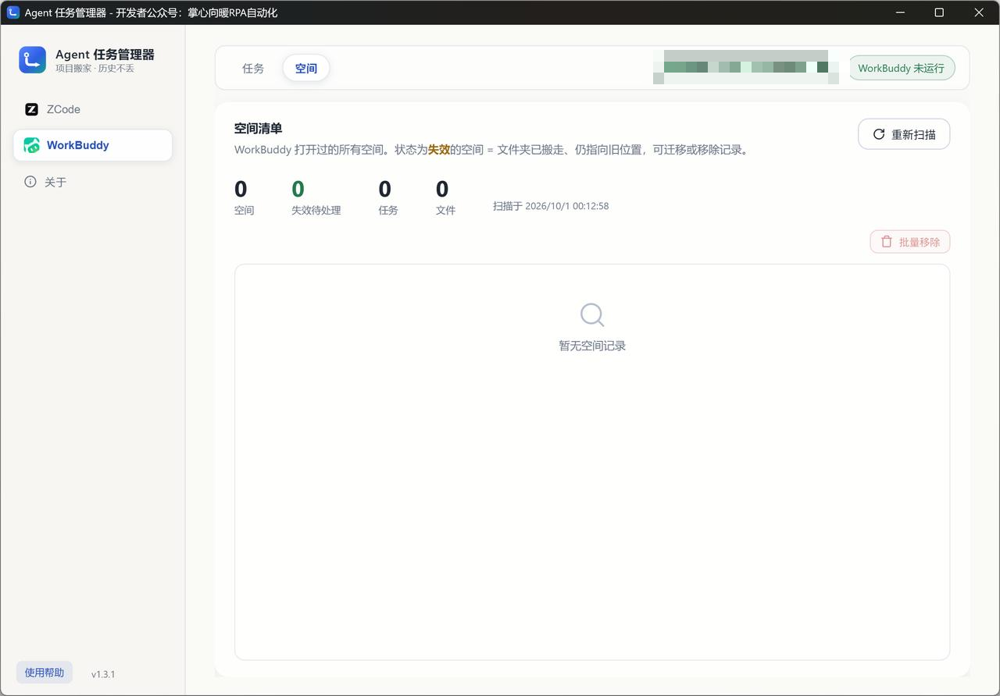

# Agent任务管理器

**项目搬家 · 历史不丢。** 一个给 ZCode 和 WorkBuddy 用户的 Windows 桌面工具：项目文件夹搬家后一键修复路径绑定、找回任务历史，顺便把堆积的任务和空间管理得干干净净。

## 它解决什么问题

如果你用过一段时间的 ZCode 或 WorkBuddy，多半遇到过这些情况：

- 把项目文件夹从 D 盘挪到 E 盘、改了个名、或者换电脑拷贝过去——左侧面板的项目突然打不开，提示「工作区目录不存在或无法访问」；
- 老任务还能看到，但点进去调不了项目技能——因为会话记住的还是旧工作目录；
- 用新路径重新打开项目后，之前的任务历史全部"消失"——它们其实还在，只是绑在旧路径上；
- WorkBuddy 的空间搬走后，下面挂着的会话集体失联。

根因在于：ZCode 把「最近项目、任务索引、会话工作目录」分别记在**三处存储**里（设置 `setting.json`、任务索引 `tasks-index.sqlite`、会话库 `db.sqlite`），任何一处没同步更新，项目就"断链"。Agent任务管理器对这套存储结构做了完整逆向，**一键把三处存储里的所有旧路径绑定同步改到新路径**——不用改注册表、不用手改数据库，历史一条不丢。

## 快速开始

前往 [Releases](https://github.com/PD-1004/agent-task-manager/releases/latest) 下载最新版：

| 文件 | 说明 |
|---|---|
| `AgentTaskManager-x.x.x.exe` | Windows 10/11 x64，下载后双击运行 |

启动后选择要管理的产品（ZCode 或 WorkBuddy）即可进入对应管理页，两个入口能力一致。

## 功能特性

| 功能 | 说明 |
|---|---|
| 路径一键迁移 | 把项目（或 WorkBuddy 空间）连同它的全部绑定搬到新路径：会话工作目录、workspaces 登记、显示名、索引文件、会话历史目录一次同步，历史记录原封不动 |
| 任务清理 | 任务清单按名称实时搜索（空格分隔多关键词，需全部命中）；支持单选 / 全选（作用于当前搜索结果）/ 批量清除，也支持逐条清除。清除为彻底删除（含聊天记录），不可恢复 |
| 文件追溯 | 双击任意任务名称，弹出该任务改动过的全部文件清单（文件名 + 完整路径），支持单条复制或一键复制全部——想知道"这个任务到底动过我哪些文件"，一下就有答案 |
| 项目任务清单 | 诊断扫描页双击项目名称，弹出该项目（含子目录）下的全部任务，显示标题、消息数、最近使用与状态——核对"这个项目到底跑过哪些任务"不用再逐个翻 |
| 失效检测 | 自动比对磁盘：文件夹还在原地标记「有效」，已搬走标记「失效」，失效即真实失联提示，不误报 |
| 空间管理 | 列出 WorkBuddy 当前账号打开过的全部空间（任务数、文件数、最早使用一目了然）；支持整体迁移、批量移除；空间自定义显示名自动识别，文件夹改名后显示名自动跟随 |
| 账号自动跟随 | 每 5 秒检测一次当前账号，切换 CodeBuddy / WorkBuddy 账号后无需重启，任务与空间列表自动刷新 |
| 诊断扫描 | 对 ZCode 记录的所有项目路径做一次全面体检：是否失效、最早使用日期、任务数、消息数、文件数，每个路径可直接「填入迁移」或「移除项目」，支持勾选批量移除 |
| 双产品入口 | ZCode 与 WorkBuddy 双入口，启动时选择，能力一致 |

> 注意：批量清除均为彻底删除（含聊天记录），不可恢复；执行清理前请先完全退出对应客户端，否则改动会被客户端写回覆盖。

## 界面预览

### 启动选择产品


### ZCode 任务管理


### WorkBuddy 空间管理



## 使用说明

### ZCode 任务页

管理「默认会话区」的任务——不打开任何具体项目、直接和 ZCode 对话产生的会话都在这里。页面顶部实时统计任务数、消息数、文件数；搜索框支持多关键词过滤；表头复选框全选的范围是"当前搜索结果"而非全部任务，配合关键词可以精准圈选一批任务批量清理。「消息数」的统计口径：你每发一句算 1 条，AI 的一次回答算 1 条（AI 调用工具续跑产生的多条记录合并计 1）；「文件数」是该任务产生、且目前仍存在于磁盘上的文件数。

### WorkBuddy 任务页

只显示当前账号的本地任务：自动读取账号快照的 `primary.uid`，只列 `user_id` 命中且非「空间」桶的会话，不含空间、不含其他账号。状态列显示「空间失效」表示该会话的工作目录在磁盘上已找不到——多为文件夹被移动 / 改名或盘符未挂载，属于真实失联提示。切换账号后无需重启，应用每 5 秒自动刷新。

### WorkBuddy 空间页

空间是会话按工作目录的投影。列表列出当前账号打开过的全部空间：显示名优先取你在 WorkBuddy 里的自定义名，否则回落到路径末段（悬停可见完整路径）；「任务数」是该空间下未删除的会话数，「文件数」是改动过且磁盘上仍存在的文件去重数。双击空间名称可核对它下面的全部任务（含已删除）；双击「文件数」可列出具体文件与路径。「迁移」会把空间连同全部会话的工作目录、登记信息、显示名、索引文件、会话历史目录整体搬到新路径——若显示名原本是自动取自旧文件夹名，还会自动跟随新文件夹名。迁移完成后重启 WorkBuddy 生效。

### 诊断扫描

列出 ZCode 记录的所有项目路径，标注是否失效、最早使用日期、任务数、消息数与文件数，是全库体检页。**双击项目名称**可查看该项目（含子目录）下的全部任务清单；发现失效路径可直接「填入迁移」修到新位置，也可勾选后批量移除。

更完整的机制说明（存储三层绑定细节、显示名规则、统计口径）见 [使用说明.md](./使用说明.md)。

## 从源码构建

当前版本的源码在 [`wails/`](./wails) 目录：

```bash
cd wails
wails build -platform windows/amd64   # 输出到 wails/build/bin/
```

技术栈：Go · Wails v2 · modernc.org/sqlite（纯 Go SQLite 驱动）· 原生 JS

> 仓库根目录下的文件是 v1.3.5 及更早版本的代码，保留供对照。

## 许可

[MIT](https://opensource.org/licenses/MIT)
